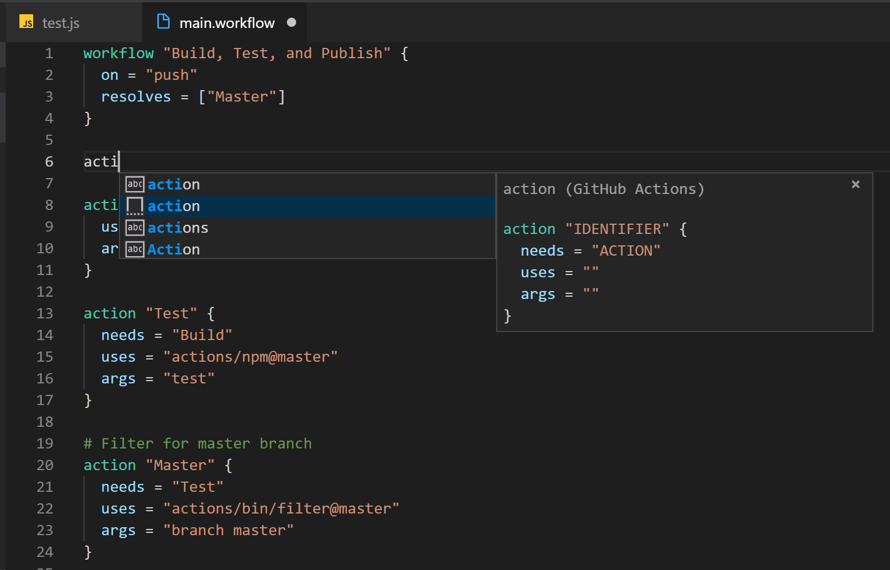

# GitHub Actions

Syntax Highlight and Snippet for GitHub Actions `main.workflow` file

## Usage

* Syntax Highlight

  Open `main.workflow` file to see syntax highlight

* Snippet

  Type `workflow` and `action` to trigger code snippet.

## Change Log

See Change Log [here](CHANGELOG.md)

## Issues

Currently, the extension is in the very initial phase. If you find any bug or have any suggestion/feature request, please submit the [issues](https://github.com/formulahendry/vscode-github-actions/issues) to the GitHub Repo.